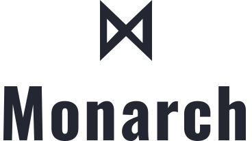

  

<h3 align="center">
  A simple but powerful PureScript library for declaring pure UIs
</h3>

  
  
  

## Getting Started

🚧 WIP 🚧

## Contributing

Please read [CONTRIBUTING.md](CONTRIBUTING.md) for details on our code of conduct, and the process for submitting pull requests to us.

## Versioning

We use [SemVer](http://semver.org/) for versioning. For the versions available, see the [tags on this repository](thebrodmann/purescript-monarch/tags).

## Authors

- **Mohammad Hasani** - _Maintainer_ - [amygdala :: ∀ a. a → IO Memory](https://github.com/thebrodmann)
- **Mahdi Seyedan** - _Collaborator_ - [jedimahdi](https://github.com/jedimahdi)

## License

This project licensed under the MPL License - see the [LICENSE](LICENSE) file for details.

## Acknowledgments

- [Elm](https://elm-lang.org/)
- [Halogen](https://github.com/purescript-halogen/purescript-halogen)
